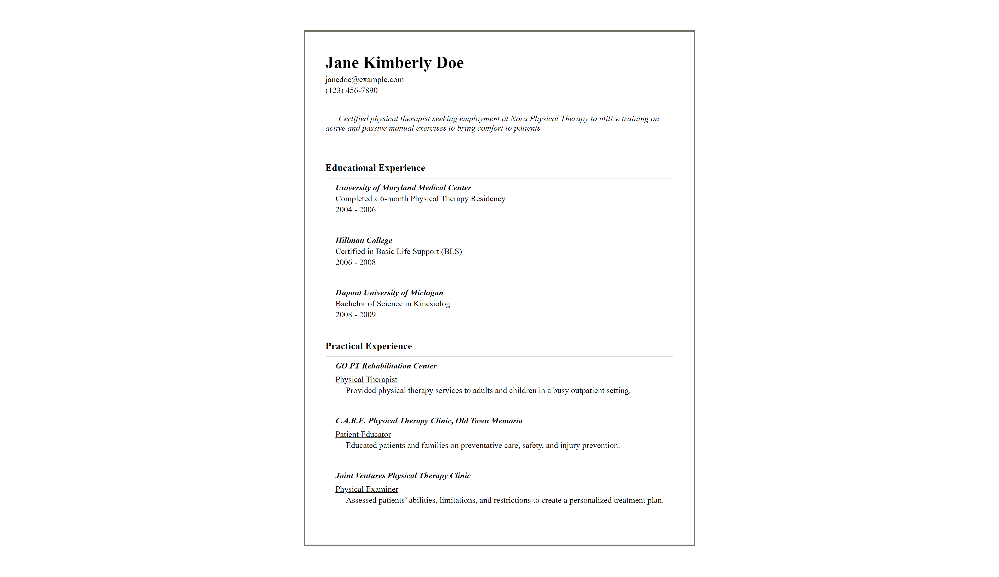

# CV Application

## Description
A 'TOP' primary React course project for React basics and principles.

### Fill up the form with programmatically validated entries.

### Look at the preview upon submission, click anywhere to go back and edit.

## React lessons covered
- React set-up with Vite
- Rendering Components using JSX
- State
- Props

## Project Link
https://www.theodinproject.com/lessons/react-new-cv-application

## Live View
https://cv-app02112024.netlify.app/
